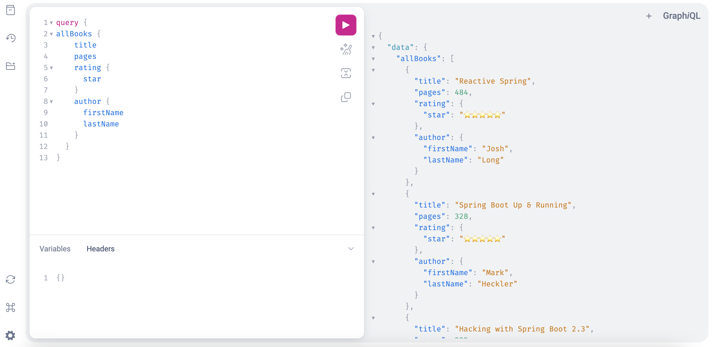

# starter-spring-graphql
🚀 GraphQL starter implementation with Spring Boot

## Introduction
This repository is a simple starter of GraphQL usage in a Spring Boot application

### Technical Stack


### Presentation

When the application is launched, GraphiQL is a graphical interactive in-browser GraphQL IDE.
You can run the application and visit http://localhost:8080/graphiql



#### GraphQL Schemas

By convention Spring will look for GraphQL Schema’s in the /src/main/resources/graphql directory
There are built-in scalar types like ID, String, Int, Float, and Boolean and can also reference object types created in our app.

Just below, you can have the definition of GraphQL objects, for example a Book Object composed by scalar types and more complex types like Author or Rating type.
The ! simply tells us that this value will never need to check for null and will always fill in.

```graphql
type Book {
    id: ID!
    title: String
    pages: Int
    rating: Rating
    author: Author
}

type Rating {
    rating: String
    star: String
}
```

**Query operation types**

- *Query*: Used to read data
- *Mutation*: Used to create, update and delete data
- *Subscription*: Similar to a query allowing you to fetch data from the server. Subscriptions offer a long-lasting operation that can change their result over time.

```graphql
type Query {
    allBooks: [Book]
    findOne(id: ID!): Book
}
```

#### Controllers implementation

The SchemaMapping annotation needs a typeName (Query, Mutation, Subscription) and the value of the schema type referenced in the schema.graphqls file
```java
@SchemaMapping(typeName = "Query",value = "allBooks")
public List<Book> findAll() {
    return bookRepository.findAll();
}
```

*Less verbose annotation*

QueryMappping is referenced directly to a SchemaMapping on type Query.
It could also be a MutationMapping or a SubscriptionMapping, the name of the schema is by default the method name

```java
@QueryMapping
public Book findOne(@Argument Integer id) {
    return bookRepository.findOne(id);
}
```